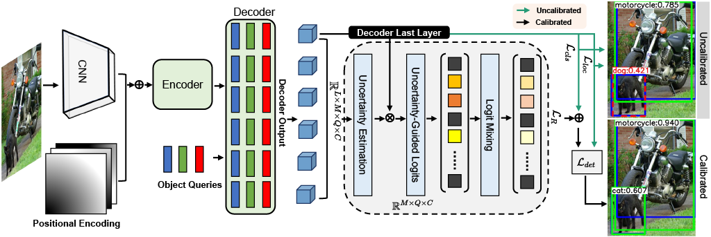
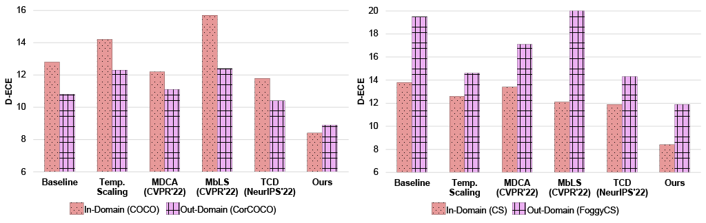
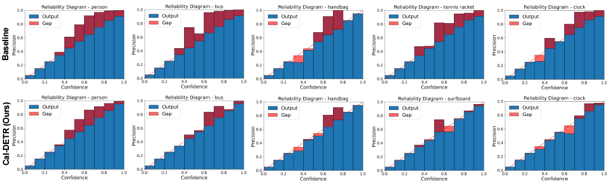

# [NeurIPS 2023] Cal-DETR: Calibrated Detection Transformer

[Paper (arXiv)]()  |   [Poster](TBA)  |   [Video](TBA)

Authors: [Muhammad Akhtar Munir](https://scholar.google.com.pk/citations?user=sT-epZAAAAAJ&hl=en), [Salman Khan](https://salman-h-khan.github.io/), [Muhammad Haris Khan](https://scholar.google.com.pk/citations?user=ZgERfFwAAAAJ&hl=en), [Mohsen Ali](https://scholar.google.com.pk/citations?user=59ISSCEAAAAJ&hl=en), [Fahad Shahbaz Khan](https://scholar.google.es/citations?user=zvaeYnUAAAAJ&hl=en)

This paper is accepted at NeurIPS 2023 and this repository contains the PyTorch implementation of our proposed Cal-DETR.

## Abstract
Albeit revealing impressive predictive performance for several computer vision tasks, deep neural networks (DNNs) are prone to making overconfident predictions. This limits the adoption and wider utilization of DNNs in many safety-critical applications. 
There have been recent efforts toward calibrating DNNs, however, almost all of them focus on the classification task. Surprisingly, very little attention has been devoted to calibrating modern DNN-based object detectors, especially detection transformers, which have recently demonstrated promising detection performance and are influential in many decision-making systems. In this work, we address the problem by proposing a mechanism for calibrated detection transformers (Cal-DETR), particularly for Deformable-DETR, UP-DETR, and DINO. We pursue the train-time calibration route and make the following contributions. First, we propose a simple yet effective approach for quantifying uncertainty in transformer-based object detectors. Second, we develop an uncertainty-guided logit modulation mechanism that leverages the uncertainty to modulate the class logits. Third, we develop a logit mixing approach that acts as a regularizer with detection-specific losses and is also complementary to the uncertainty-guided logit modulation technique to further improve the calibration performance. Finally, we perform extensive experiments on three in-domain and four out-domain scenarios. Results corroborate the effectiveness of Cal-DETR against the competing train-time methods in calibrating both in-domain and out-domain detections while maintaining or even improving the detection performance.



## Results



Reliability Diagrams: Selected classes from MS-COCO.



### Cal-DETR comparison with baseline, post-hoc, and other train-time calibration losses
Results report Detection Expected Calibration Error (D-ECE) for In-Domain (MS-COCO) and Out-Domain (CorCOCO).

| Methods                                                      | D-ECE (MS-COCO) | APbox (MS-COCO) |    D-ECE (CorCOCO)    | APbox (CorCOCO) | model | 
|--------------------------------------------------------------|:---------:|:----------:|:---------:|:------:|:------:|
| [Baseline](https://arxiv.org/abs/2010.04159)                 |   12.8   |   44.0    |   10.8   |   23.9    | [link](https://drive.google.com/file/d/1q45sjir00jcTDgYf1zrGWyiAy8MQT9JF/view?usp=share_link)     |
| [Temp. Scaling](https://arxiv.org/abs/1706.04599)            |   14.2   |   44.0    |   12.3   |   23.9   |  -   |
| [MDCA](https://arxiv.org/abs/2203.13834)                     |   12.2   |   44.0    |   11.1   |   23.5   |   [link](https://drive.google.com/file/d/1CsXpzU55fMKrQzQ6EUmkZAGmzgo60eTE/view?usp=share_link)  |
| [MbLS](https://arxiv.org/abs/2111.15430)                     |   15.7   |   44.4    |   12.4   |   23.5    |  [link](https://drive.google.com/file/d/1U_-5QK036hCskMXeUMkSTc98iTg1fkR8/view?usp=share_link)    |
| [TCD](https://proceedings.neurips.cc/paper_files/paper/2022/file/fcd812a51b8f8d05cfea22e3c9c4b369-Paper-Conference.pdf)                                          |   11.8   |   44.1    |   10.4    |   23.8    |   [link](TBA)   |
| [Cal-DETR]()                                          |   8.4   |   44.4    |   8.9    |   24.0    |   [link](TBA)   |


## Setup

Requirements: This implementation is on:

Linux, CUDA>=11.0

Python>=3.7

PyTorch>=1.7.0

## Installation

For complete Installation and usage instructions, follow the guidelines [here](https://github.com/fundamentalvision/Deformable-DETR#installation)

## For more setup details (Training and Evaluation etc.) we refer [here](https://github.com/akhtarvision/bpc_calibration)

## Citation

Please cite the following, if you find this work useful in your research:

```bibtex
@article{munir2023caldetr,
  title={Cal-DETR: Calibrated Detection Transformer},
  author={ Munir, Muhammad Akhtar and Khan, Salman and Khan, Muhammad Haris and Ali, Mohsen and Khan, Fahad},
  journal={Neural Information Processing Systems (NeurIPS)},
  year={2023}
}
```
```bibtex
@article{munir2023bridging,
  title={Bridging Precision and Confidence: A Train-Time Loss for Calibrating Object Detection},
  author={ Munir, Muhammad Akhtar and Khan, Muhammad Haris and Khan, Salman and Khan, Fahad},
  journal={IEEE Conference on Computer Vision and Pattern Recognition (CVPR)},
  year={2023}
}
```

## Contact
In case of any query, create issue or contact akhtar.munir@mbzuai.ac.ae 

## Acknowledgement
This codebase is built on <a href="https://github.com/fundamentalvision/Deformable-DETR">Deformable-DETR</a> and <a href="https://pypi.org/project/netcal/">Detection Calibration</a>


